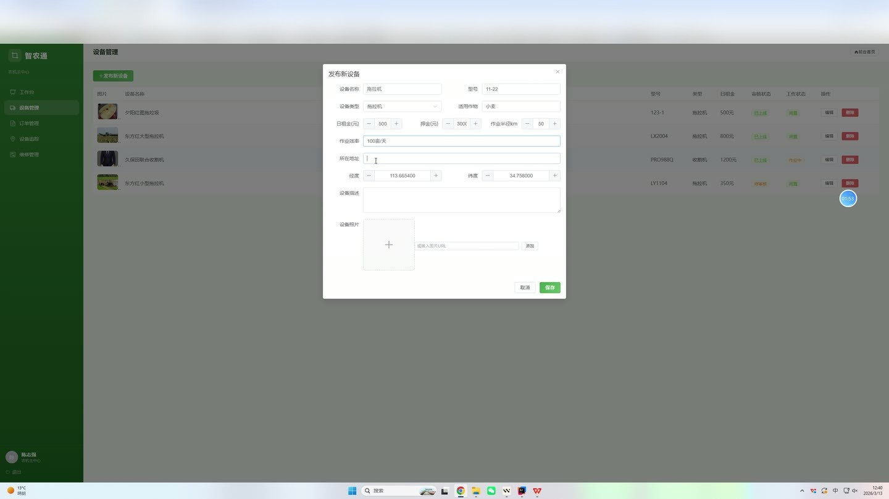
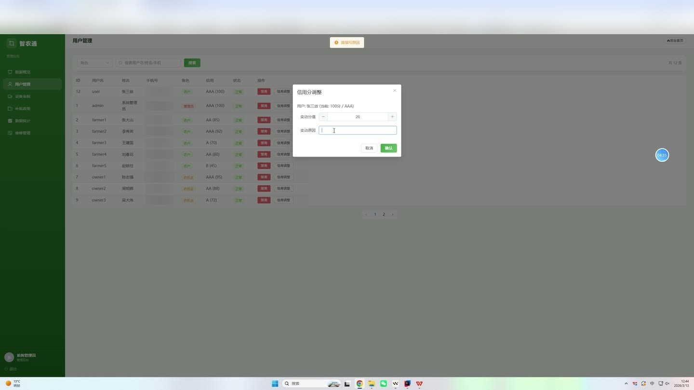
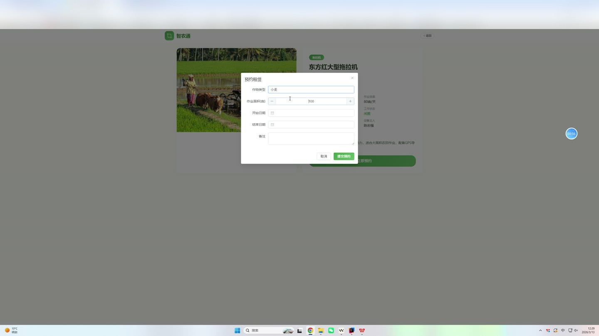
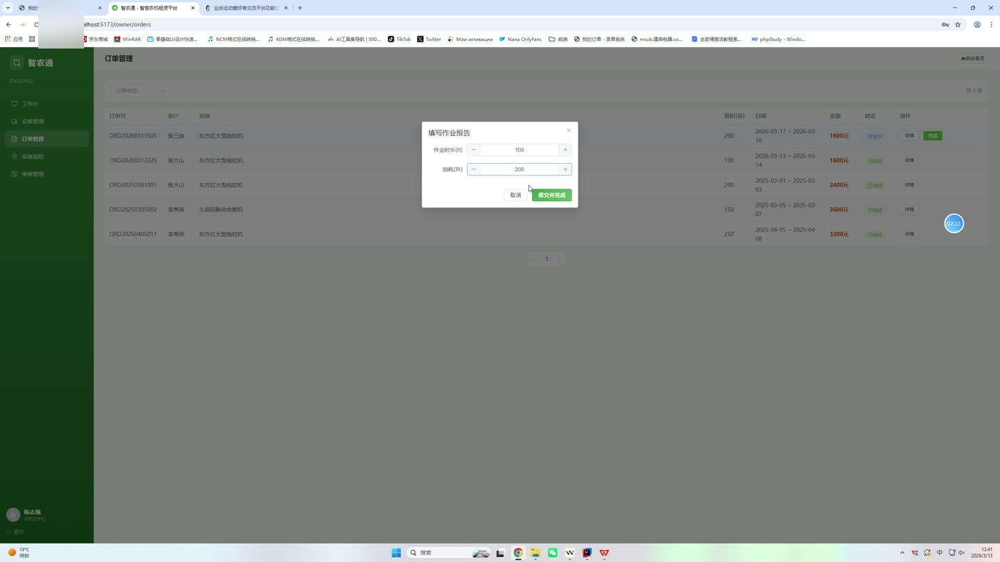

# (附文档)Springboot2+Vue3+MySQL 农机租赁系统系统

**技术栈**：Springboot2、Vue3、MySQL

### 系统简介

智农通农机租赁系统是一个基于 Spring Boot 2 + Vue 3 前后端分离的 B2B 农机租赁平台，涵盖农户、农机主、管理员三个角色。系统提供农机发布与检索、在线下单与电子合同、智能匹配推荐、维修报修、信用积分、补贴政策管理及数据统计看板等核心业务功能，实现农机租赁全流程数字化管理。
 
### 核心功能
 
### 普通用户端

 
- 浏览农机公开列表，支持按类型（拖拉机/收割机/播种机/无人机/灌溉机/其他）和关键词（名称/型号/作物类型）筛选 
- 查看农机详情，包含多张图片轮播、规格参数、租赁价格、押金、作业半径、地理位置及机主信息 
- 使用智能匹配功能，输入作物类型、作业面积、经纬度坐标，系统基于贪心算法按匹配度（作物匹配40分/距离30分/效率20分/价格10分）推荐前10台适配农机 
- 在线下单租赁农机，填写作业面积、租赁起止日期，系统自动生成标准化电子合同（含甲乙双方信息、设备信息、租金押金、责任条款） 
- 查看个人订单列表，支持按订单状态（待付款/进行中/已完成/已取消）筛选 
- 查看订单详情，包含合同内容、支付记录、作业记录（作业时长/油耗） 
- 提交维修报修单，填写设备、问题描述，系统自动匹配最近维修网点并分配 
- 查看维修记录列表与详情，包含维修费用、农户与机主分摊比例、维修进度状态 
- 查看个人信用中心，显示信用分、信用等级（AAA/AA/A/B/C）、信用变更记录明细 
- 修改个人资料，包含真实姓名、手机号、头像等字段
 
### 农机主端

 
- 查看个人农机列表，管理名下所有设备 
- 发布新农机，填写名称、型号、类型、适用作物类型、作业效率、租赁价格、押金、作业半径、位置经纬度与地址、描述信息，支持上传多张图片并设置排序 
- 编辑已有农机信息，更新价格、状态、描述等字段 
- 删除名下农机设备 
- 修改农机工作状态（空闲/作业中/维修中） 
- 查看收到的租赁订单列表，按状态筛选，查看订单详情与电子合同 
- 确认订单状态变更（接单/拒绝/完成） 
- 查看设备实时跟踪列表，显示设备位置与工作状态 
- 查看与名下设备相关的维修报修单，确认维修费用分摊比例（农户/机主比例） 
- 查看个人信用中心，包含信用分与等级
 
### 管理员端

 
- 查看系统仪表盘，总览用户数（农户/机主）、设备数（总设备/在线设备）、订单数（总订单/已完成）、待处理维修数、平台总收入等核心指标 
- 管理用户列表，支持按角色（农户/机主/管理员）和关键词（用户名/真实姓名/手机号）搜索，查看用户详情 
- 启用或禁用用户账号（状态开关） 
- 审核农机设备，将设备状态变更为审核通过/驳回 
- 管理补贴政策，新增/编辑/删除补贴政策（名称、描述、补贴比例、最低信用等级要求、有效期起止、启用状态） 
- 查看所有订单列表，按状态筛选，查看订单详情 
- 查看所有维修报修单，手动分配维修网点，更新维修状态 
- 查看数据统计图表：订单趋势（近6个月订单量与金额）、设备类型分布（拖拉机/收割机等占比）、收入统计（近6个月收入与补贴金额） 
- 查看所有用户信用记录，手动添加信用变更记录（加分/扣分并填写原因）
 
### 技术栈

 后端框架Spring Boot 2.7.x ORMMyBatis-Plus（含分页插件、自动填充） 权限认证JWT（拦截器校验，排除登录/注册/公开接口） 前端框架Vue 3（Composition API + script setup） 状态管理Pinia 路由Vue Router 4（Hash 模式，角色守卫） UI 组件库Element Plus 构建工具Vite 数据库MySQL 8.0（含完整初始化脚本） 文件上传MultipartFile 本地存储
 
### 交付内容

 
- 后端完整源码 
- 前端完整源码 
- 数据库初始化脚本 
- 万字文档

## 界面展示

---

## 获取完整源码 + 万字文档

本仓库为项目介绍页。**完整前后端源码、数据库初始化脚本、万字项目文档**，请加微信 `kangkangcode`，或访问 [codekk.top](http://codekk.top) 获取。

可作课程设计 / 毕业设计参考，支持远程部署调试。